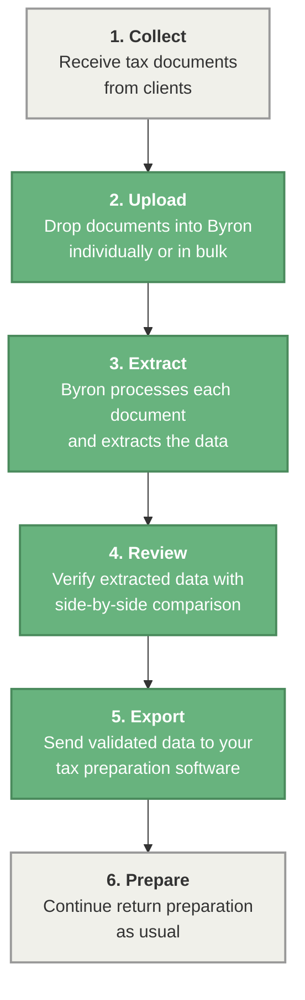

Byron handles the most time-consuming part of tax preparation: getting data out of source documents and into your tax software. Upload W-2s, 1099s, K-1s, and other tax forms, and Byron extracts the data, maps it to the right fields, and exports it in a format your prep software accepts — reducing manual data entry from hours to minutes.

Byron is built for tax professionals who need speed without sacrificing accuracy, and firms that want to scale their capacity without scaling their headcount.

## Why use Byron

<Card title="Byron eliminates the manual bottleneck between receiving tax documents and preparing returns." icon="star">
  **Near-perfect accuracy**\
  Byron's AI extracts data from tax documents with 98–99% accuracy, reducing the errors that come with manual data entry and minimizing review cycles.

  **Up to 16 hours back per complex return**\
  Byron turns hours of manual data entry into minutes. The hardest documents see the biggest gains — a K-1 that takes around 90 minutes to key in by hand is processed in about 10. On a complex return with 10\+ K-1s and Schedule C, that's up to 16 hours back per return, compounding across every client in your season.

  **Built for tax professionals**\
  Byron understands tax forms — not just as documents, but as structured data with specific fields, schedules, and filing requirements. The platform is purpose-built for the way tax firms operate.
</Card>

## Who Byron is for

<Card title="Byron is used by tax professionals and firms of all sizes to reduce manual data entry and accelerate return preparation." icon="users-gear">
  **Solo practitioners and small firms**

  - CPAs and EAs handling high volumes of individual returns during tax season
  - Small firms looking to increase capacity without hiring additional staff
  - Practitioners who want to spend more time on advisory work and less on data entry

  **Mid-size and regional firms**

  - Firms processing thousands of returns across multiple preparers
  - Operations managers looking to standardize document intake workflows
  - Teams that need to onboard seasonal staff quickly with minimal training

  **Large firms and enterprises**

  - Multi-office firms that need consistent document processing at scale
  - Organizations with compliance requirements around data handling and accuracy
  - Firms integrating document processing into broader workflow automation
</Card>

## What you can do with Byron

<Card title="Byron supports the full document processing workflow, from upload to export." icon="sparkles">
  **Document upload and intake**\
  Upload tax documents individually or in bulk. Byron accepts scans and digital PDFs — and automatically identifies the document type.

  **AI-powered data extraction**\
  Byron reads each document, extracts the relevant data fields, and maps them to the corresponding tax form lines.

  **Review and validation**\
  Review extracted data side-by-side with the original document. Flag and correct any fields before export, with confidence scores that highlight where to focus your attention.

  **Export to tax software**\
  Export processed data directly into your tax preparation software. Byron formats the output to match your platform's import requirements, so there's no reformatting or manual re-entry.

  **Batch processing**\
  Process multiple clients' documents in a single batch. Track progress across your queue and prioritize returns based on your firm's workflow.
</Card>

## How Byron fits into your workflow

## Security, privacy, and compliance

Byron is built to meet the data protection requirements of tax professionals handling sensitive client information. For more information on how we ensure full  Byron is built to meet the data protection requirements of tax professionals handling sensitive client information. For more information on how we ensure full Byron is built to meet the data protection requirements of tax professionals handling sensitive client information.

### Data protection

- Documents are processed in secure, isolated environments
- Client data is never used to train AI models

### Access and identity

- Role-based access controls for teams
- Multi-factor authentication (MFA)
- Audit logs for all document processing activity

For more information on how we protect your data and ensure full compliance visit the related [Security and Compliance documentation](/security/compliance).

For more information on how we protect your data and ensure full compliance visit the related Security and Compliance documentation.

### Legal

- [Privacy Policy](/legal/privacy)
- [Terms of Service](/legal/terms)